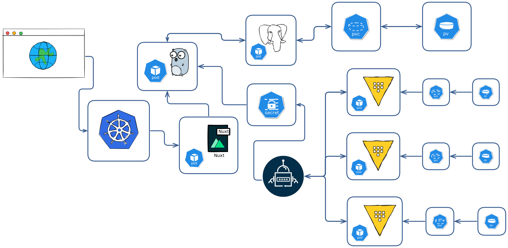

HashiCorp Vault is a powerful tool for securely accessing secrets, such as API keys, credentials, and certificates. It helps you centrally store, access, and manage secrets across environments. Vault supports multiple authentication backends, dynamic secret generation, fine-grained access control, and advanced audit capabilities—making it a go-to choice for security-conscious teams deploying cloud-native infrastructure.

## 🧠 Overview

In this tutorial, we’ll walk through deploying [HashiCorp Vault](https://www.vaultproject.io/) in a **production-grade**, **highly available**, and **secure** manner on an **on-premises K3s cluster**. We'll:

- Set up Vault with **TLS encryption**
- Use **Raft** as the integrated storage backend (no external dependencies)
- Deploy Vault using **Helm**
- Expose secrets using **External Secrets Operator (ESO)** instead of sidecars



---

## ✅ Why TLS?

Vault **must** use HTTPS in production to protect secrets in transit. Even in a local or on-prem cluster, you should:

- Encrypt traffic between apps and Vault
- Ensure the Raft protocol uses secure channels
- Enable certificate verification for client authentication (if needed later)

We’ll use **Kubernetes CertificateSigningRequest** API to generate and approve certificates for TLS.

---

## 🤔 Why ESO over Sidecars?

Traditionally, Vault Agent is used to inject secrets into workloads via a **sidecar container**. However:

| Feature            | Sidecar (Vault Agent)     | ESO (External Secrets Operator) |
| ------------------ | ------------------------- | ------------------------------- |
| GitOps friendly    | ❌ No (imperative)        | ✅ Yes (declarative YAML)       |
| Pod resource usage | 🔺 More (extra container) | 🟢 Less                         |
| Complexity         | ⚠️ Complex                | ✅ Simpler CRDs                 |
| Flexibility        | Good                      | Great with native K8s secrets   |

👉 We’re going with ESO to follow GitOps and simplify operations.

---

## 🛠️ Prerequisites

- An on-prem K3s cluster (v1.21+)
- `kubectl` configured
- Helm installed
- OpenSSL and `jq` CLI tools

---

## 🔐 Setting up Vault

Let's first start by setting up vault into our cluster with Helm chart we will go through the generation of the TLS Certificates, helm values and unsealing the vault pod.

---

### Add the Vault Helm Chart

```zsh
helm repo add hashicorp https://helm.releases.hashicorp.com
helm repo update
```

---

### Set Up Working Directory and Env Variables

```zsh
mkdir ~/vault && cd ~/vault

export VAULT_K8S_NAMESPACE="vault"
export VAULT_HELM_RELEASE_NAME="vault"
export VAULT_SERVICE_NAME="vault-internal"
export K8S_CLUSTER_NAME="cluster.local"
export WORKDIR=~/vault
```

---

### Generate TLS Certificates with Kubernetes CSR

We’ll generate a private key, create a CSR config, and then issue a cert signed by Kubernetes itself.

```zsh
openssl genrsa -out ${WORKDIR}/vault.key 2048
```

#### CSR Configuration

```zsh
cat > ${WORKDIR}/vault-csr.conf <<EOF
[req]
default_bits = 2048
prompt = no
encrypt_key = yes
default_md = sha256
distinguished_name = kubelet_serving
req_extensions = v3_req
[ kubelet_serving ]
O = system:nodes
CN = system:node:*.${VAULT_K8S_NAMESPACE}.svc.${K8S_CLUSTER_NAME}
[ v3_req ]
basicConstraints = CA:FALSE
keyUsage = nonRepudiation, digitalSignature, keyEncipherment, dataEncipherment
extendedKeyUsage = serverAuth, clientAuth
subjectAltName = @alt_names
[alt_names]
DNS.1 = *.${VAULT_SERVICE_NAME}
DNS.2 = *.${VAULT_SERVICE_NAME}.${VAULT_K8S_NAMESPACE}.svc.${K8S_CLUSTER_NAME}
DNS.3 = *.${VAULT_K8S_NAMESPACE}
IP.1 = 127.0.0.1
EOF
```

#### Create CSR

```zsh
openssl req -new -key ${WORKDIR}/vault.key -out ${WORKDIR}/vault.csr -config ${WORKDIR}/vault-csr.conf
```

#### Create and Approve CSR in Kubernetes

```zsh
cat > ${WORKDIR}/csr.yaml <<EOF
apiVersion: certificates.k8s.io/v1
kind: CertificateSigningRequest
metadata:
  name: vault.svc
spec:
  signerName: kubernetes.io/kubelet-serving
  expirationSeconds: 8640000
  request: $(cat ${WORKDIR}/vault.csr | base64 | tr -d '\n')
  usages:
  - digital signature
  - key encipherment
  - server auth
EOF

kubectl create -f ${WORKDIR}/csr.yaml
kubectl certificate approve vault.svc
```

#### Save Certificate & CA

```zsh
kubectl get csr vault.svc -o jsonpath='{.status.certificate}' | openssl base64 -d -A -out ${WORKDIR}/vault.crt

kubectl config view --raw --minify --flatten \
  -o jsonpath='{.clusters[].cluster.certificate-authority-data}' | base64 -d > ${WORKDIR}/vault.ca
```

---

### Create Namespace and Secret

```zsh
kubectl create namespace $VAULT_K8S_NAMESPACE

kubectl create secret generic vault-ha-tls -n $VAULT_K8S_NAMESPACE \
  --from-file=vault.key=${WORKDIR}/vault.key \
  --from-file=vault.crt=${WORKDIR}/vault.crt \
  --from-file=vault.ca=${WORKDIR}/vault.ca
```

### Helm Override Values

```yaml
cat > ${WORKDIR}/overrides.yaml <<EOF
global:
  enabled: true
  tlsDisable: false
injector:
  enabled: true
server:
  extraEnvironmentVars:
    VAULT_CACERT: /vault/userconfig/vault-ha-tls/vault.ca
    VAULT_TLSCERT: /vault/userconfig/vault-ha-tls/vault.crt
    VAULT_TLSKEY: /vault/userconfig/vault-ha-tls/vault.key
  volumes:
    - name: userconfig-vault-ha-tls
      secret:
        defaultMode: 420
        secretName: vault-ha-tls
  volumeMounts:
    - mountPath: /vault/userconfig/vault-ha-tls
      name: userconfig-vault-ha-tls
      readOnly: true
  standalone:
    enabled: false
  affinity: ""
  ha:
    enabled: true
    replicas: 3
    raft:
      enabled: true
      setNodeId: true
      config: |
        cluster_name = "vault-integrated-storage"
        ui = true
        listener "tcp" {
          tls_disable = 0
          address = "[::]:8200"
          cluster_address = "[::]:8201"
          tls_cert_file = "/vault/userconfig/vault-ha-tls/vault.crt"
          tls_key_file  = "/vault/userconfig/vault-ha-tls/vault.key"
          tls_client_ca_file = "/vault/userconfig/vault-ha-tls/vault.ca"
        }
        storage "raft" {
          path = "/vault/data"
        }
        disable_mlock = true
        service_registration "kubernetes" {}
EOF
```

### ⛴️ 📦 Install Vault with Helm

```zsh
helm install -n $VAULT_K8S_NAMESPACE $VAULT_HELM_RELEASE_NAME hashicorp/vault -f ${WORKDIR}/overrides.yaml
kubectl get pods -n $VAULT_K8S_NAMESPACE
```

---

### Initialize and Unseal Vault

```zsh
kubectl exec -n $VAULT_K8S_NAMESPACE vault-0 -- vault operator init \
  -key-shares=5 -key-threshold=3 -format=json > ${WORKDIR}/cluster-keys.json
```

```zsh
jq -r ".unseal_keys_b64[]" ${WORKDIR}/cluster-keys.json
```

#### Unseal `vault-0`

```zsh
VAULT_UNSEAL_KEY1=$(jq -r ".unseal_keys_b64[0]" ${WORKDIR}/cluster-keys.json)
VAULT_UNSEAL_KEY2=$(jq -r ".unseal_keys_b64[1]" ${WORKDIR}/cluster-keys.json)
VAULT_UNSEAL_KEY3=$(jq -r ".unseal_keys_b64[2]" ${WORKDIR}/cluster-keys.json)

kubectl exec -n $VAULT_K8S_NAMESPACE vault-0 -- vault operator unseal $VAULT_UNSEAL_KEY1
kubectl exec -n $VAULT_K8S_NAMESPACE vault-0 -- vault operator unseal $VAULT_UNSEAL_KEY2
kubectl exec -n $VAULT_K8S_NAMESPACE vault-0 -- vault operator unseal $VAULT_UNSEAL_KEY3
```

#### Join and Unseal `vault-1`

```zsh
kubectl exec -n $VAULT_K8S_NAMESPACE -it vault-1 -- /bin/sh

vault operator raft join -address=https://vault-1.vault-internal:8200 \
  -leader-ca-cert="$(cat /vault/userconfig/vault-ha-tls/vault.ca)" \
  -leader-client-cert="$(cat /vault/userconfig/vault-ha-tls/vault.crt)" \
  -leader-client-key="$(cat /vault/userconfig/vault-ha-tls/vault.key)" \
  https://vault-0.vault-internal:8200

exit

kubectl exec -n $VAULT_K8S_NAMESPACE vault-1 -- vault operator unseal $VAULT_UNSEAL_KEY1
kubectl exec -n $VAULT_K8S_NAMESPACE vault-1 -- vault operator unseal $VAULT_UNSEAL_KEY2
kubectl exec -n $VAULT_K8S_NAMESPACE vault-1 -- vault operator unseal $VAULT_UNSEAL_KEY3
```

#### Join and Unseal `vault-2`

```zsh
kubectl exec -n $VAULT_K8S_NAMESPACE -it vault-2 -- /bin/sh

vault operator raft join -address=https://vault-2.vault-internal:8200 \
  -leader-ca-cert="$(cat /vault/userconfig/vault-ha-tls/vault.ca)" \
  -leader-client-cert="$(cat /vault/userconfig/vault-ha-tls/vault.crt)" \
  -leader-client-key="$(cat /vault/userconfig/vault-ha-tls/vault.key)" \
  https://vault-0.vault-internal:8200

exit

kubectl exec -n $VAULT_K8S_NAMESPACE vault-2 -- vault operator unseal $VAULT_UNSEAL_KEY1
kubectl exec -n $VAULT_K8S_NAMESPACE vault-2 -- vault operator unseal $VAULT_UNSEAL_KEY2
kubectl exec -n $VAULT_K8S_NAMESPACE vault-2 -- vault operator unseal $VAULT_UNSEAL_KEY3
```

#### Export Root Token & Login

```zsh
export CLUSTER_ROOT_TOKEN=$(cat ${WORKDIR}/cluster-keys.json | jq -r ".root_token")

kubectl exec -n $VAULT_K8S_NAMESPACE vault-0 -- vault login $CLUSTER_ROOT_TOKEN
kubectl exec -n $VAULT_K8S_NAMESPACE vault-0 -- vault operator raft list-peers
```

---

### Enable and Store a Test Secret

```zsh
vault secrets enable -path=secret kv-v2
vault kv put secret/app/db DB_USER="admin" DB_PASS="secret"
vault kv get secret/app/db
```

---

### Port Forward and Access API

```zsh
kubectl -n vault port-forward service/vault 8200:8200
```

```zsh
curl --cacert $WORKDIR/vault.ca \
  --header "X-Vault-Token: $CLUSTER_ROOT_TOKEN" \
  https://127.0.0.1:8200/v1/secret/data/app/db | jq .data.data
```

---

## Setting up External Secrets Operator (ESO) 🧪

### Configure Vault Kubernetes Auth for ESO

```zsh
vault write auth/kubernetes/config \
  kubernetes_host="https://$KUBERNETES_PORT_443_TCP_ADDR:443"

vault policy write read-ondb - <<EOF
path "secret/data/app/db" {
  capabilities = ["read"]
}
EOF

vault write auth/kubernetes/role/external-secrets-role \
  bound_service_account_names=external-secrets \
  bound_service_account_namespaces=external-secrets \
  policies=read-ondb \
  ttl=24h
```

### ⛴️ 📦Install ESO with Helm

```zsh
helm repo add external-secrets https://charts.external-secrets.io
helm upgrade --install external-secrets \
  external-secrets/external-secrets -n external-secrets --create-namespace
```

### Create `ClusterSecretStore`

```zsh
kubectl apply -f -<<EOF
apiVersion: external-secrets.io/v1beta1
kind: ClusterSecretStore
metadata:
  name: vault-backend
spec:
  provider:
    vault:
      server: https://vault.vault.svc.cluster.local:8200
      tlsServerName: vault.vault-internal
      path: "kubernetes"
      version: "v2"
      caProvider:
        type: Secret
        name: vault-ha-tls
        key: vault.ca
        namespace: vault
      auth:
        kubernetes:
          mountPath: "auth/kubernetes"
          role: "db-creds"
          serviceAccountRef:
            name: default
            namespace: default
EOF
```

### Create `ExternalSecret`

```zsh
kubectl apply -f - <<EOF
apiVersion: external-secrets.io/v1beta1
kind: ExternalSecret
metadata:
  name: db-secret
  namespace: default
spec:
  refreshInterval: 1h
  secretStoreRef:
    name: vault-backend
    kind: ClusterSecretStore
  target:
    name: db-secret # Name of the K8s Secret that will be created
    creationPolicy: Owner # ESO manages lifecycle
  data:
    - secretKey: DB_USER
      remoteRef:
        key: app/db
        property: DB_USER
    - secretKey: DB_PASS
      remoteRef:
        key: app/db
        property: DB_PASS
EOF
```

---

### Use Secrets in a Pod

```yaml
env:
  - name: DB_USER
    valueFrom:
      secretKeyRef:
        key: DB_USER
        name: db-secret
  - name: DB_PASS
    valueFrom:
      secretKeyRef:
        key: DB_PASS
        name: db-secret
```

---

## 🚀 Final Thoughts

This guide sets you up with:

- Highly Available Vault using Raft
- TLS encryption with Kubernetes-issued certs
- Secret injection using GitOps-friendly ESO

---
